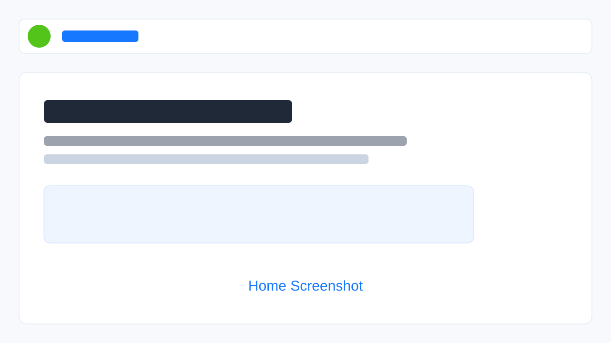
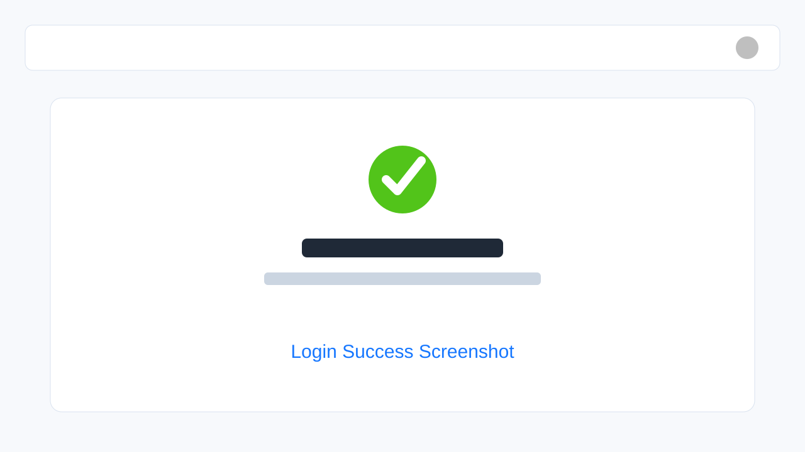
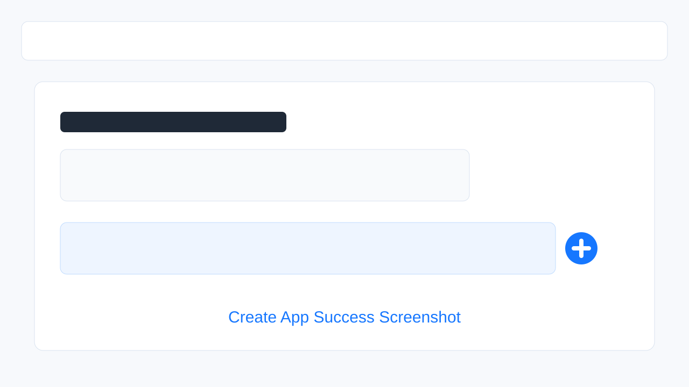
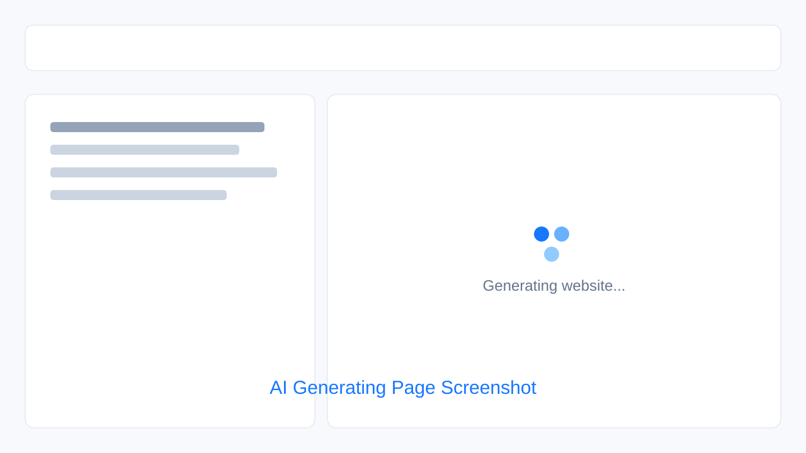
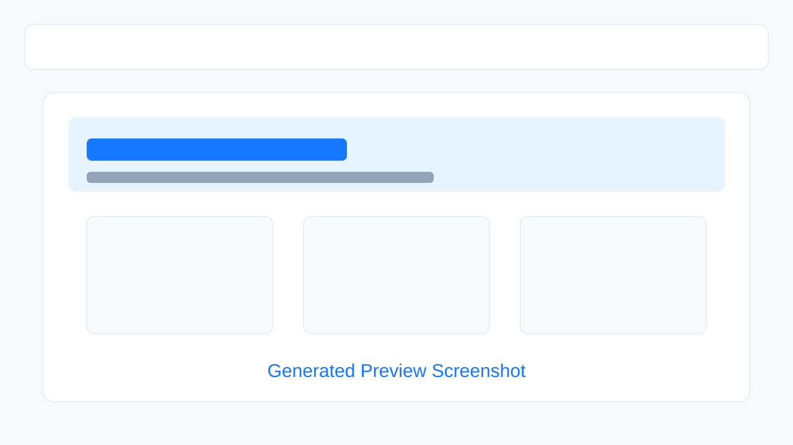

# AI Agent 智能体对话应用开发

> 基于 Spring AI + Spring Boot + RAG + 工具调用 + MCP 构建的多模型 AI 智能体应用。系统支持 ReAct 自主思考、多轮对话隔离、记忆持久化、RAG 知识库检索、结构化输出、Prompt 优化、工具调用和 MCP 服务接入。

本项目来自简历项目「AI Agent 智能体对话应用开发」，建设周期为 2025 年 10 月至 2025 年 12 月。项目面向 AI 应用开发场景，目标是让智能体能够在多轮对话中自主规划、调用工具、检索知识库并完成复杂任务。

## 在线访问

| 类型 | 地址 |
| --- | --- |
| 前端应用 | [http://124.221.85.117](http://124.221.85.117) |
| 接口文档 | [http://124.221.85.117/api/doc.html#/home](http://124.221.85.117/api/doc.html#/home) |

## 项目亮点

- 已完成前后端分离部署：Vue 3 静态资源由 Nginx 托管，后端 Spring Boot Jar 以生产环境配置启动。
- 接入 MySQL / Redis，支持用户、应用、对话历史等核心数据持久化与缓存能力。
- 接入 AI Key，支持根据用户提示词创建应用并生成可预览页面。
- 提供接口文档，便于调试、联调和展示后端接口能力。
- 支持生成应用后的页面预览、代码下载和部署操作，形成从需求输入到作品发布的完整闭环。
- 基于 ReAct 模式实现自主思考与工具调用，支持复杂任务拆解和执行过程流式输出。
- 通过 RAG、Tool Calling、MCP 和 Human-in-the-Loop 架构增强智能体的可用性和稳定性。

## 技术栈

| 模块 | 技术 |
| --- | --- |
| 前端 | Vue 3、TypeScript、Vite、Ant Design Vue、Pinia、Axios |
| 后端 | Spring Boot、Spring AI、MyBatis-Plus、LangChain4j、Knife4j |
| AI 能力 | RAG、Tool Calling、MCP、ReAct、Advisor、Prompt 优化 |
| 存储 | MySQL、Redis、Caffeine、PgVector |
| 部署 | Nginx、Jar 进程部署、Serverless、生产环境配置 |

## 简历亮点

- 基于 Spring AI 统一接入灵积与本地部署 Ollama，构建多模型可切换策略，在保证模型能力的同时将 API 调用成本降低 50%。
- 基于 Spring AI ChatMemory + Advisor 实现多轮对话记忆体系，结合 Caffeine 预加载历史会话数据，在高并发场景下将上下文命中率提升至 95%，平均响应延迟降低 30%。
- 构建 MySQL + Redis 分层持久化架构，引入 Kryo 序列化，使序列化体积减少 60%、读写性能提升 2-3 倍，重启后上下文恢复率达 99%。
- 搭建完整 RAG 知识检索体系，完成文档 ETL、PgVector 向量存储、多查询扩展与查询重写，使知识问答准确率提升 45%。
- 集成 6 类工具调用并设计统一注册与调度机制，结合 ToolContext 实现用户身份传递与参数校验，避免无效执行并提升系统稳定性。
- 开发支持 Stdio 与 SSE 双传输模式的 MCP 图片搜索服务并采用 Serverless 部署，降低跨项目接入成本 50%。
- 基于 OpenManus 引入 Human-in-the-Loop 架构，并增加步数限制与死循环检测机制，使系统异常中断率下降 80%。
- 通过 SseEmitter + CompletableFuture 实现流式输出与异步推理架构，实时输出执行过程，使用户等待感知时间减少 80%。

## 功能展示

> 真实截图建议统一放在 `docs/screenshots/` 目录。当前先放置展示占位图，等截图文件补齐后可直接替换为真实页面截图。

### 首页

### 登录成功

### 创建应用成功

### AI 生成页面

### 生成结果预览

## 部署记录

- 前端：构建 `dist` 后通过 Nginx 托管静态资源。
- 后端：使用生产环境配置启动 Spring Boot Jar。
- 反向代理：Nginx 将 `/api` 请求转发到后端服务。
- 数据服务：MySQL 保存业务数据，Redis 提供缓存支持。
- 文档入口：Knife4j 接口文档已通过线上地址访问。

## 适合简历描述

基于 Spring AI + Spring Boot + RAG + Tool Calling + MCP 构建多模型 AI 智能体应用，支持 ReAct 自主规划、多轮对话记忆、RAG 知识库检索、结构化输出、Prompt 优化、工具调用、MCP 图片搜索服务和流式响应，实现从用户任务输入到智能体规划执行的完整链路。
