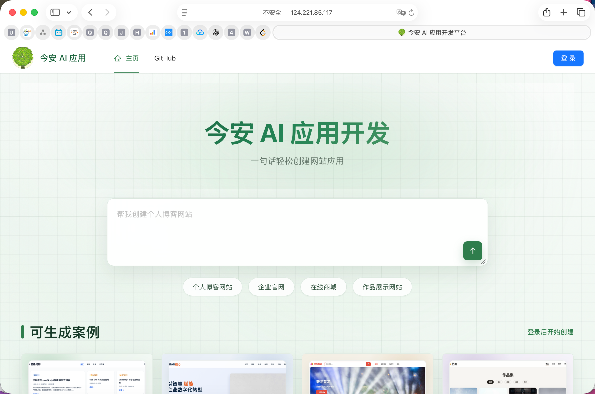
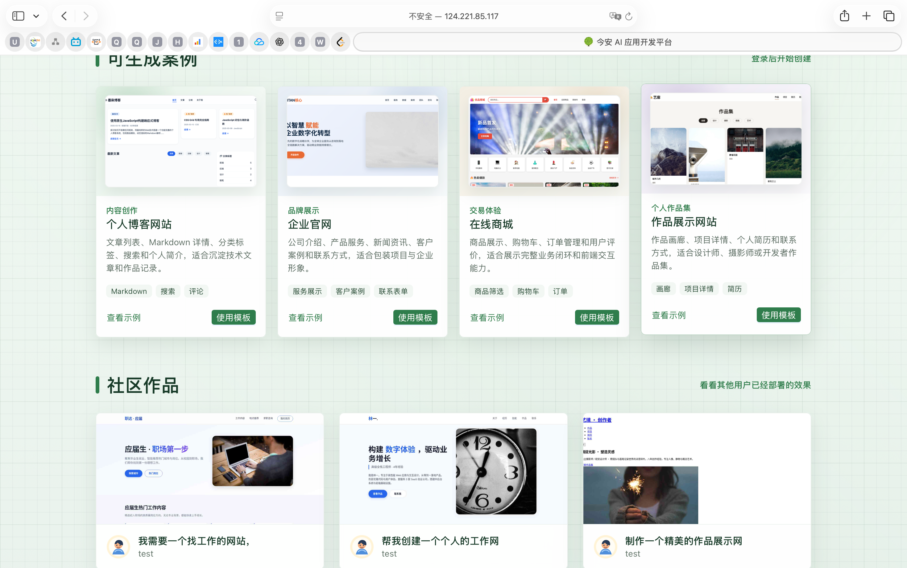
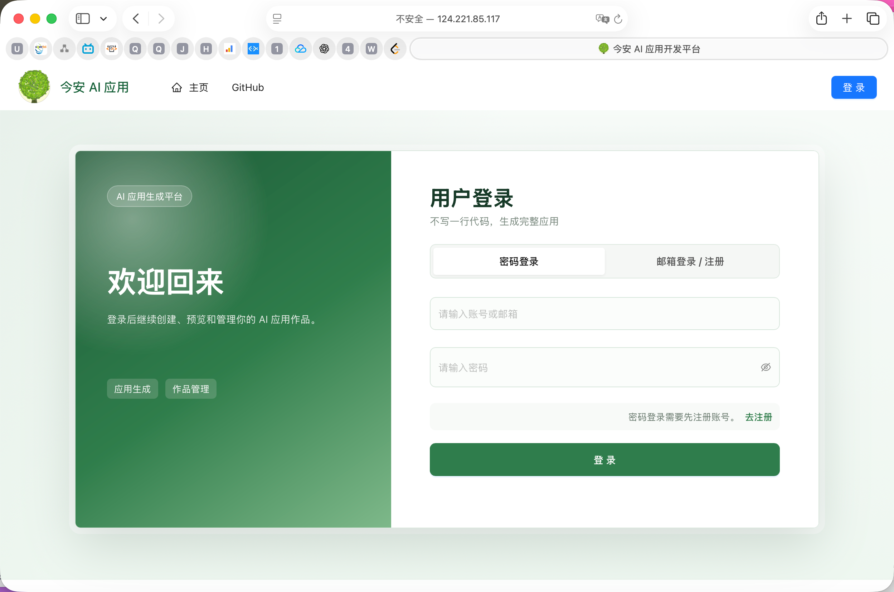
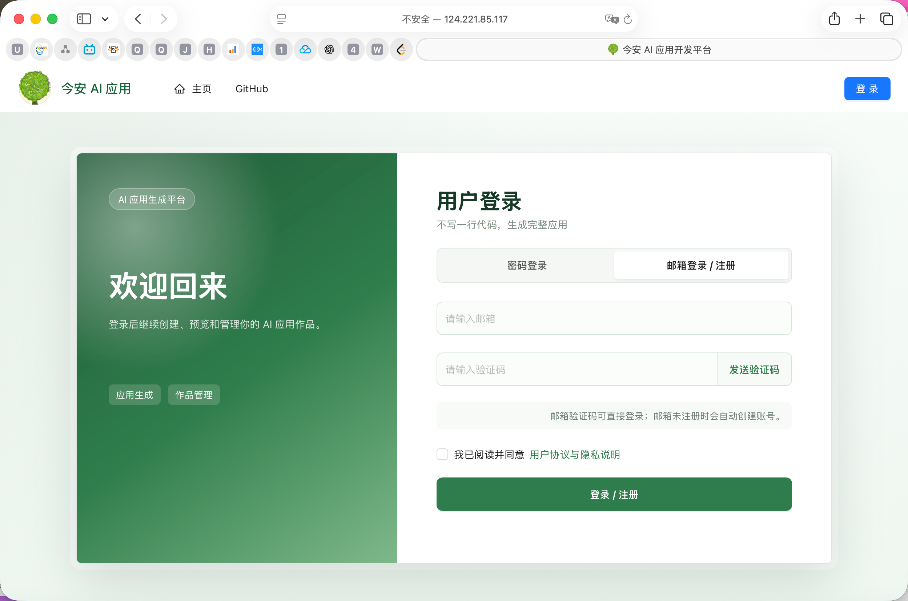
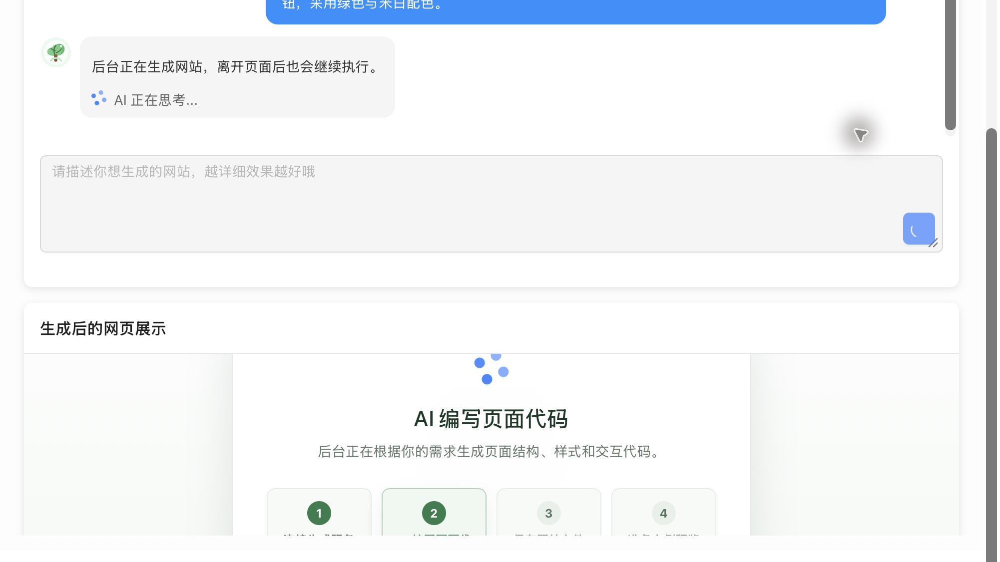
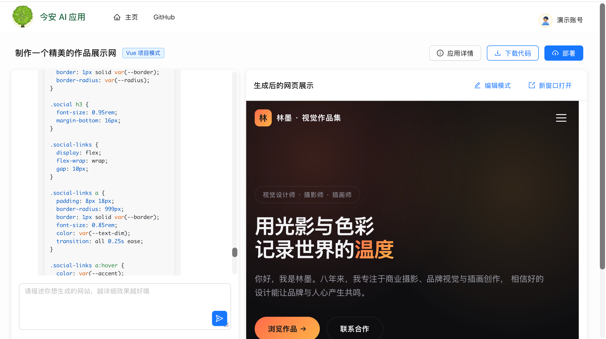
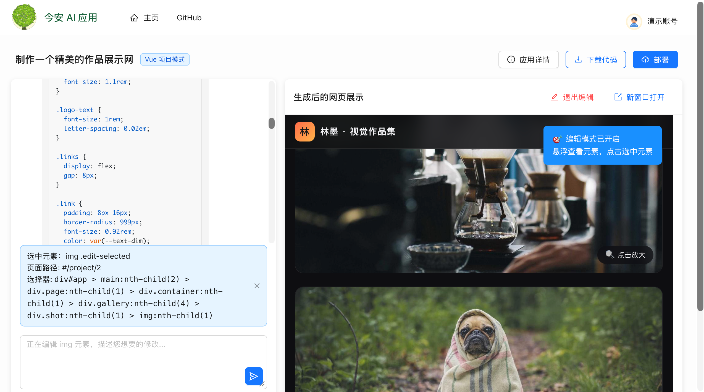

# 今安 AI 应用开发平台

> 基于 Vue 3、Spring Boot、LangChain4j、Dubbo 与 Nacos 构建的微服务化 AI 代码生成平台。用户可以用自然语言描述需求，生成 HTML、多文件网站或 Vue 项目，并继续完成可视化修改、在线预览、源码下载与部署发布。

## 在线体验

| 类型 | 地址 |
| --- | --- |
| 在线应用 | [https://ai.lijinan.cn](https://ai.lijinan.cn) |
| 接口文档 | [https://ai.lijinan.cn/api/doc.html#/home](https://ai.lijinan.cn/api/doc.html#/home) |
| OpenAPI JSON | [https://ai.lijinan.cn/api/v3/api-docs](https://ai.lijinan.cn/api/v3/api-docs) |
| GitHub 源码 | [Li-Jinan/code-ai-agent](https://github.com/Li-Jinan/code-ai-agent) |

## 项目定位

本项目面向 AI 应用工程与 Agent 工程场景，目标不是做一个通用聊天机器人，而是把大模型能力接入真实的网站生成工作流：

```text
用户输入网站需求
 -> 创建应用并选择生成类型
 -> AI 生成 HTML / 多文件网站 / Vue 项目
 -> SSE 返回生成过程，Tool Calling 完成项目文件操作
 -> 在线预览并通过对话或可视化选区继续修改
 -> 下载源码 / 部署站点 / 生成作品封面
```

## 微服务架构

当前主实现位于 `code-ai-agent-microservice`。其中 `app`、`user`、`screenshot` 是可独立运行的 Spring Boot 服务，`ai`、`client`、`model`、`common` 是供服务复用的 Maven 模块。

```text
Browser
  └─ Vue 3 / Nginx
       ├─ /api/user/** -> user-service (8124) -> MySQL / Redis
       └─ /api/**      -> app-service  (8125) -> MySQL / Redis / AI
                              ├─ Dubbo -> user-service
                              └─ Dubbo -> screenshot-service (8127)
                                             └─ Selenium -> Tencent COS

app-service / user-service / screenshot-service -> Nacos
```

线上由 Nginx 提供统一入口：用户接口路由到 `user-service`，应用、对话、预览与接口文档路由到 `app-service`。服务间通过 Dubbo 调用，并使用 Nacos 完成注册与发现。

### 模块职责

| 模块 | 类型 | 主要职责 |
| --- | --- | --- |
| `code-ai-agent-app` | 独立服务 | 应用管理、对话历史、AI 生成编排、限流、预览、下载与部署 |
| `code-ai-agent-user` | 独立服务 | 用户注册、登录、会话与用户管理，并向应用服务提供用户 RPC |
| `code-ai-agent-screenshot` | 独立服务 | 通过 Selenium 生成部署页截图并上传腾讯云 COS |
| `code-ai-agent-ai` | 共享模块 | LangChain4j 模型接入、代码生成服务、对话记忆、护栏与文件工具 |
| `code-ai-agent-client` | 共享模块 | Dubbo 内部服务接口 |
| `code-ai-agent-model` | 共享模块 | 实体、DTO、VO 与枚举 |
| `code-ai-agent-common` | 共享模块 | 通用响应、异常、配置、常量与基础能力 |

## 核心能力

- **多类型代码生成**：根据需求生成单页 HTML、多文件网站或 Vue 项目，并自动选择合适的生成类型。
- **流式生成反馈**：通过 SSE 实时返回模型输出和工具执行信息，前端同步展示生成过程。
- **Agent 文件工具**：封装文件读取、写入、修改、删除、目录读取和退出工具，使 Vue 项目可以在受控目录内持续迭代。
- **应用级上下文**：使用 Redis ChatMemory 隔离不同应用的上下文，并从 MySQL 对话历史恢复会话。
- **可视化修改**：在预览区选择页面元素，将标签、选择器、文本和页面路径作为上下文继续生成。
- **结果交付闭环**：支持 iframe 预览、源码压缩下载、站点部署和作品封面生成。
- **服务治理**：基于 Nacos 与 Dubbo 完成服务注册、发现和 RPC，使用 Redis Session 共享登录态。
- **稳定性设计**：使用 Redisson 进行用户级限流，使用 Caffeine 缓存应用级 AI 服务实例。

## 核心链路

### 1. 用户与会话

Nginx 将 `/api/user/**` 路由到 `user-service`。用户服务负责注册、登录和用户管理，登录会话保存在 Redis；应用服务通过 Dubbo 获取用户信息。

### 2. 创建应用与选择生成类型

前端调用 `POST /api/app/add` 创建应用。应用服务根据初始需求选择 HTML、多文件或 Vue 项目生成模式，并在 MySQL 中保存应用信息。

### 3. AI 对话生成

前端通过 `GET /api/app/chat/gen/code` 发起生成请求。应用服务调用 `code-ai-agent-ai` 中的 LangChain4j 服务，以 SSE 返回生成过程；Vue 模式可通过 Tool Calling 直接操作项目文件。

生成过程中会保存用户消息与 AI 回复，并按 `appId + codeGenType` 缓存 AI 服务实例，减少重复初始化开销。

### 4. 预览、编辑与交付

生成文件保存后，前端可在 iframe 中预览结果，也可以选中页面元素继续修改。用户还可以下载完整源码，或调用 `POST /api/app/deploy` 发布站点。

### 5. 部署封面生成

应用部署完成后，`app-service` 通过 Dubbo 调用 `screenshot-service`。截图服务使用 Selenium 访问部署页面，生成作品封面并上传到腾讯云 COS。

## 技术栈

| 模块 | 技术 |
| --- | --- |
| 前端 | Vue 3、TypeScript、Vite、Ant Design Vue、Pinia、Axios |
| 后端 | Java 21、Spring Boot、MyBatis-Flex、Spring Session、Knife4j |
| AI 能力 | LangChain4j、Tool Calling、SSE、Redis ChatMemory、输入护栏 |
| 微服务 | Dubbo、Nacos、Nginx |
| 数据与缓存 | MySQL、Redis、Redisson、Caffeine |
| 文件与自动化 | 本地生成目录、腾讯云 COS、Selenium |

## 功能展示

> 以下均为线上环境真实页面截图。

### 首页

#### 需求输入与模板入口



#### 可生成案例与社区作品



### 登录与注册

#### 账号密码登录



#### 邮箱验证码登录 / 注册



### 创建应用与 AI 生成过程



### 生成结果预览



### 可视化编辑模式



## 项目结构

```text
code-ai-agent
├── code-ai-agent-frontend              # Vue 3 前端
├── code-ai-agent-microservice           # 当前微服务主实现
│   ├── code-ai-agent-app                # 应用与 AI 生成服务
│   ├── code-ai-agent-user               # 用户服务
│   ├── code-ai-agent-screenshot         # 截图服务
│   ├── code-ai-agent-ai                 # AI 能力与工具模块
│   ├── code-ai-agent-client             # Dubbo 内部接口
│   ├── code-ai-agent-model              # 公共数据模型
│   └── code-ai-agent-common             # 公共基础模块
├── docs/screenshots                     # README 真实页面截图
└── src                                  # 原单体实现，保留用于演进对照
```

## 本地启动

### 环境要求

- JDK 21、Maven、Node.js
- MySQL、Redis、Nacos
- 可用的模型 API Key
- 如需生成部署封面，还需配置 Selenium 与腾讯云 COS

请先为三个服务配置本地环境参数，不要将数据库密码、模型 Key 或 COS 密钥提交到 Git。

### 后端

构建全部微服务模块：

```bash
./mvnw -f code-ai-agent-microservice/pom.xml clean package -DskipTests
```

准备好 MySQL、Redis 与 Nacos 后，依次启动用户服务、截图服务和应用服务：

```bash
java -jar code-ai-agent-microservice/code-ai-agent-user/target/code-ai-agent-user-1.0-SNAPSHOT.jar
java -jar code-ai-agent-microservice/code-ai-agent-screenshot/target/code-ai-agent-screenshot-1.0-SNAPSHOT.jar
java -jar code-ai-agent-microservice/code-ai-agent-app/target/code-ai-agent-app-1.0-SNAPSHOT.jar
```

默认 HTTP 端口分别为 `8124`、`8127` 和 `8125`。

### 前端

```bash
cd code-ai-agent-frontend
npm install
npm run dev
```

## 项目名称与描述

**项目名称：** 今安 AI 应用开发平台（`code-ai-agent`）

**项目描述：** 基于 Spring Boot、LangChain4j、Dubbo 与 Nacos 构建的微服务化 AI 代码生成平台。系统将用户、应用生成与网页截图拆分为独立服务，支持自然语言生成 HTML、多文件网站和 Vue 项目，并通过应用级对话记忆、Tool Calling、SSE 流式反馈、可视化选区修改、在线预览、源码下载、站点部署和自动封面生成，形成从需求输入到应用交付的完整链路。
